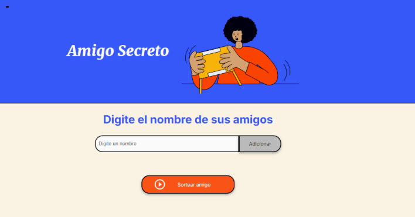

# 🎁 Challenge: Amigo Secreto

Aplicación interactiva para realizar sorteos de **Amigo Secreto**, desarrollada como parte de un desafío de lógica de programación de Alura Latam.
Este proyecto me permitió poner en práctica conceptos fundamentales como **variables, condicionales, funciones, listas (arrays)** y **bucles**, que son la base de cualquier lenguaje de programación.  

## 🚀 Funcionalidades

✅ Agregar nombres de participantes a una lista.  
✅ Validar que el nombre no esté vacío antes de añadirlo.  
✅ Realizar el sorteo aleatorio de un amigo secreto.  
✅ Mostrar el resultado en pantalla de manera clara y sencilla.  

## 🧑‍💻 Tecnologías utilizadas

- **HTML5** → Estructura de la aplicación.  
- **CSS3** → Estilos y diseño visual (ya provistos en el desafío).  
- **JavaScript (ES6+)** → Lógica del programa: funciones, arrays, condicionales y bucles.  

## 📚 Objetivo de aprendizaje

Este desafío tiene como propósito **fortalecer el razonamiento lógico y la base de la programación**, enfocándose en:

- **Variables** → Para almacenar y manipular datos dinámicos.  
- **Condicionales** (`if/else`) → Para controlar el flujo de ejecución.  
- **Funciones** → Para modularizar el código y reutilizar lógica.  
- **Listas (arrays)** → Para manejar múltiples elementos.  
- **Bucles** (`for`, `while`) → Para iterar de manera eficiente sobre los elementos.  

- 👉 Estos fundamentos son comunes a todos los lenguajes de programación, por lo que dominarlos facilita aprender cualquier tecnología o plataforma.  

## 🖼️ Vista previa

  

## Ejemplo de uso

- 1) Escribe  el nombre de tus amigos en el campo de texto y presiona "Adicionar".
- 2) Una vez que hayas agregado todos los participantes, haz click en "Sortear amigo".
- 3) La aplicación mostrará un nombre al azar como tu amigo secreto. 🎁

## Autor
- 👩‍💻 Desarrollado por Agustina Gonella

## Este proyecto forma parte del programa de formación Oracle Next Education (ONE) en colaboración con Alura Latam.